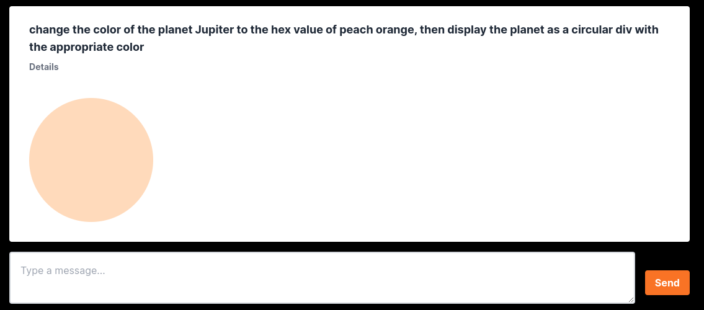
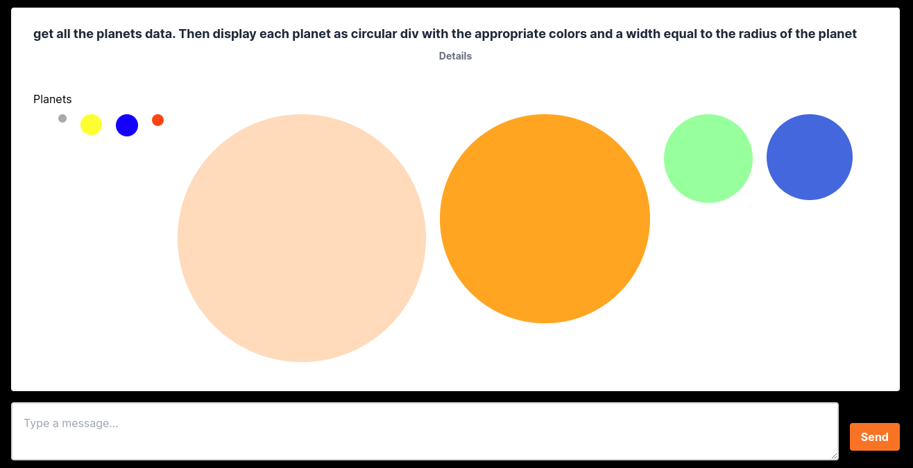
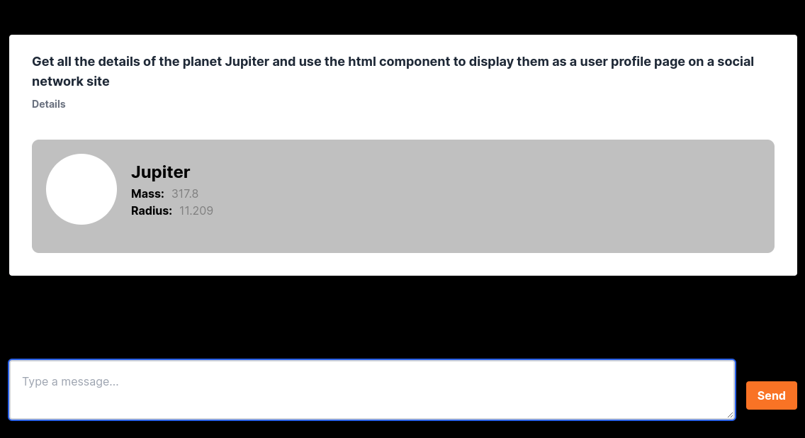
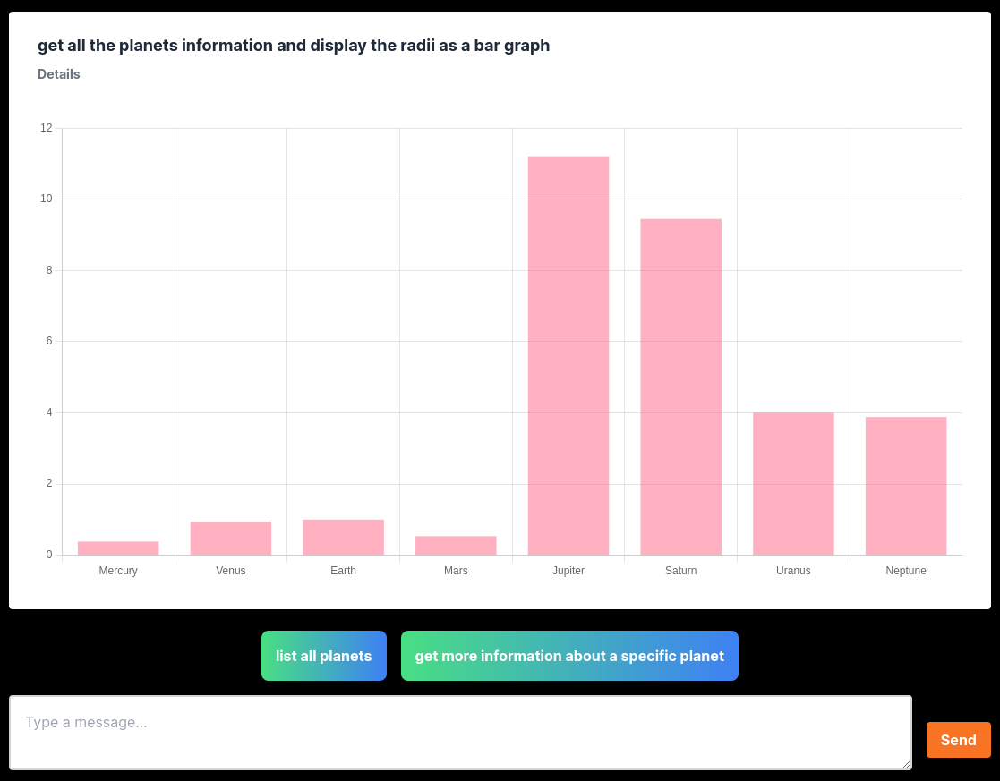

# ex-Nihilo

**ex-Nihilo** is a technical demonstration for creating new UI ex-Nihilo in an application as the need arises, using AI to generate interface components on the fly that minimize the energy necessary either to convey information to a user or to get information from the user for storage in the data store.

It has a **Python3 / FastAPI** backend and a **TypeScript / NextJS** frontend.

## Running the dev environment

### From the server directory

```
python -m venv env
pip install requirements.txt
uvicorn main:app --reload
```

### From the web-client directory

```
npm install
npm run dev
```

## Examples








